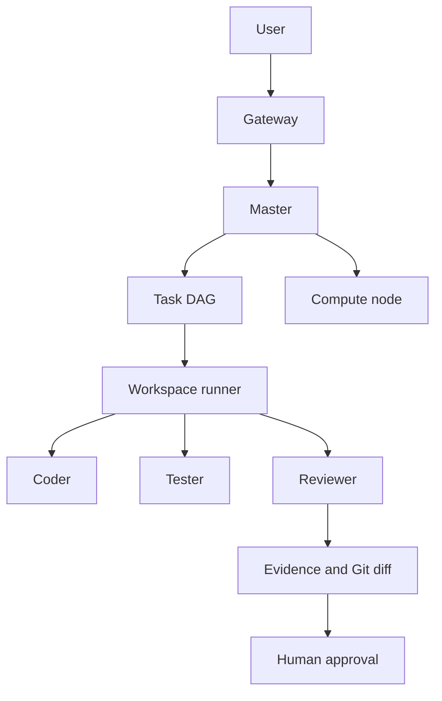

# System overview

The Master owns intent interpretation and delegation. Coder changes only its assigned workspace. Tester and Reviewer are independent roles. Compute absence queues or pauses inference work; it never deletes task state.
